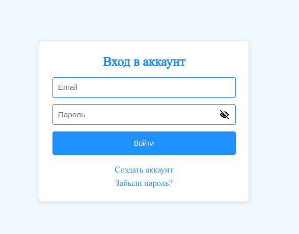
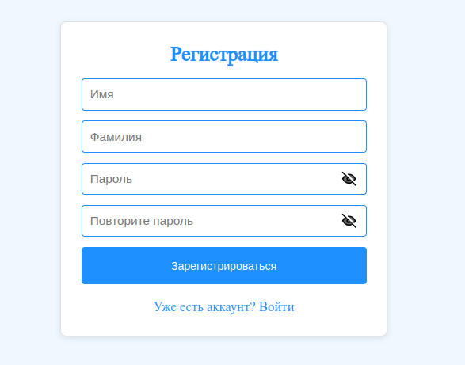
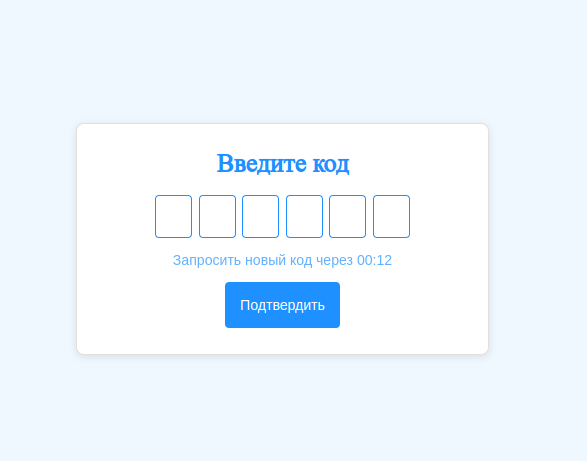
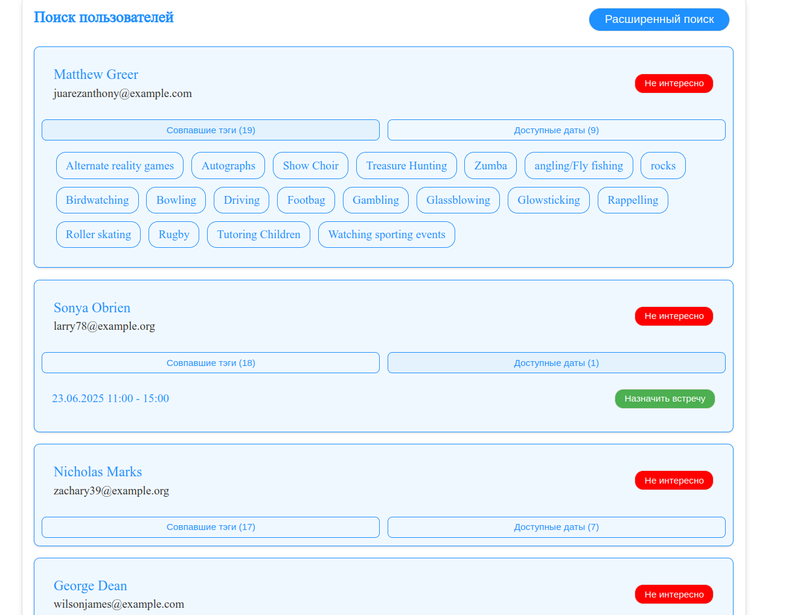
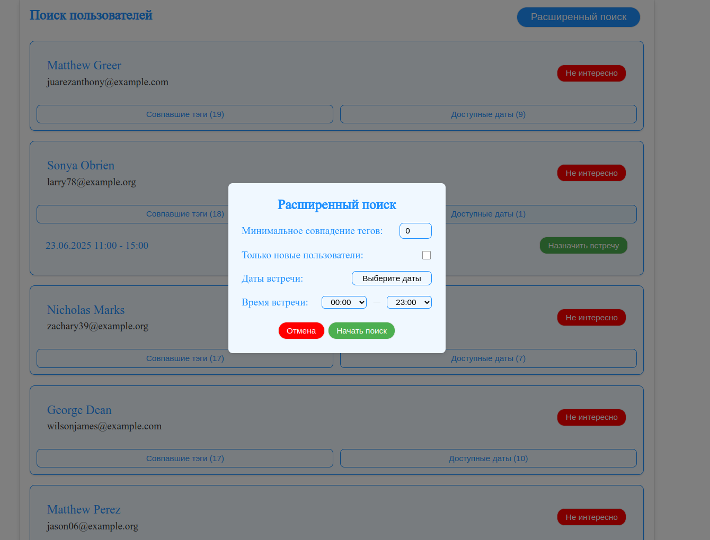
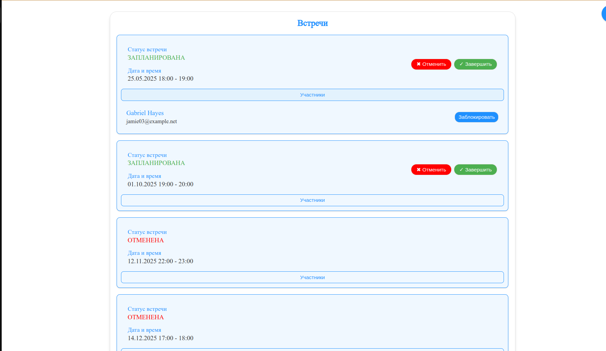
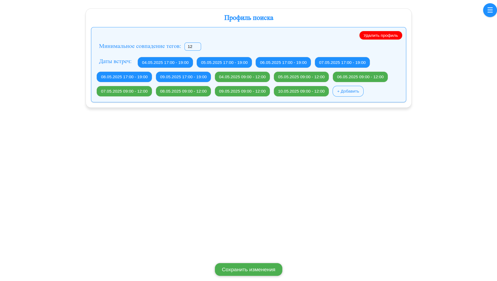
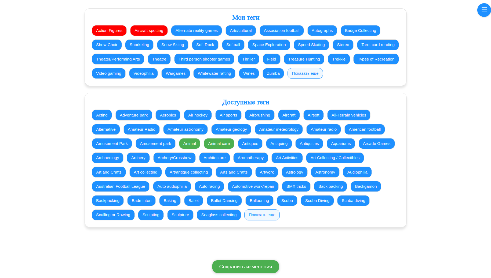
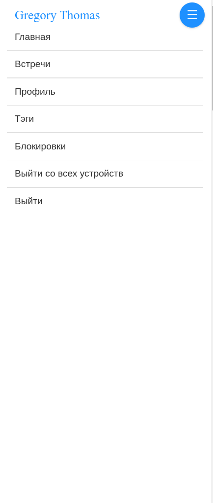

# Random-Coffee ☕️

[](https://www.docker.com/)
[](https://fastapi.tiangolo.com/)
[](https://www.postgresql.org/)
[](https://www.mongodb.com/)
[](https://redis.io/)
[](https://www.rabbitmq.com/)
[](https://reactjs.org/)

Сервис для организации случайных встреч на основе общих интересов и доступного времени.


## 🚀 Основные возможности

### 💡 Базовый функционал
- **Умный поиск встреч**:
  - Мэтчинг по тегам интересов
  - Фильтрация по времени и дате
  - Фильтрация по прошедшим встречам
  
- **Управление встречами**:
  - Создание собственных встреч в определенные даты
  - Подтверждение/Отмена встреч
  - История встреч и список назначенных встреч

- **Управление тэгами**:
  - Добавление/Удаление тэгов

- **Система модерации**:
  - Блокировка пользователей


## 🛠 Технологический стек

### Backend
- **Framework**: FastAPI
- **Базы данных**: 
  - PostgreSQL (пользовательские данные)
  - MongoDB (логика мэтчинга)
  - Redis (xранение временных данных)
- **Брокер сообщений**: RabbitMQ

### Frontend
- **Framework**: React 


## 🏗 Архитектура проекта

### 🧱 Сервисная структура
| Сервис               | Технологии       | Назначение                          |
|-----------------------|------------------|-------------------------------------|
| **API Gateway**       | Nginx          | Единая точка входа для запросов     |
| **Auth Service**      | PostgreSQL, Redis, RabbitMQ       | Создание аккаунта/Вход в аккаунт. Смена пароля. Создание/Обновление/Удаление JWT токенов. Уведомление сервисов о создании нового пользователя |
| **Email Service**  | Redis, RabbitMQ    |  Подтверждение почты. Уведомление Auth Service о подтверждении почты  |
| **Email Sender Service**      | RabbitMQ  | Отправка писем     |
| **Tags Service**      | PostgreSQL, RabbitMQ  | Добавление/Удаление пользовательских тэгов. Уведомление сервисов об изменении пользовательских тэгов    |
| **Meeting Service**      | PostgreSQL, RabbitMQ  | Создание/Отмена/Завершение встреч пользователей. Блокировка/Разблокировка пользователя. Уведомление сервисов о создании или изменении статуса встречи|
| **Search Service**      | MongoDB, RabbitMQ  | Поиск встреч. Создание собственных дат встреч     |
| **Frontend**          | React            | Пользовательский интерфейс         |

## 🚀 Быстрый старт

### Запуск проекта

```bash
git clone https://github.com/your-username/random-coffee
cd random-coffee
# Перейдите в папку с конфигами
cd configs
# Отредактируйте файлы в любом текстовом редакторе. Например:
nano auth_service.env
docker-compose up --d
```


## 🖥 Визуальный гид по функционалу

### Вход в аккаунт

- **Обработка ошибок**: При не верном логине или пароле.
- **Ограничение**: Количество попыток на ввод пароля по умолчанию равно 5 после чего следующая попытка будет возможна только через час или при смене пароля.


### Регистрация

- **Ограничение**: На одну почту можно зарегистрировать только один аккаунт.


### Подтверждение почты

- **Применение**: Отправка кода подтверждения на почту пользователя. Без подтверждения почты невозможно зарегистрироваться или сменить пароль.
- **Ограничение**: Для повторной отправки письма с кодом необходимо подождать определенно количество времени. Также при неправильно введенном коде более 5 раз код будет считаться недействительным.


### Поиск пользователей

- **Применение**: Поиск позволяет найти пользователя для встречи среди пользователей, у которых есть активные даты встреч. Пользователи сортируются по количеству совпавших тэгов(от максимального совпадения до минимального).
- **Просмотр совпавших тэгов**: При нажатии на кнопку "Совпавшие тэги" у пользователя можно посмотреть какие именно тэги совпали.
- **Просмотр активных дат встреч**: При нажатии на кнопку "Доступные даты" можно посмотреть в какие даты можно назначить встречу с пользователем. Чтобы назначить встречу с пользователем достаточно нажать кнопку "Назначить встречу" напротив определенной даты.


### Расширенный поиск

- **Применение**: С помощью расширенного поиска можно найти пользователей, у которых есть активные встречи на определенную дату или время, а также настроить минимальное число совпавших тэгов.


### Встречи

- **Применение**: Просмотр запланированных/прошедших встреч и их участников. 
- **Отмена/Завершение встречи**: Кнопки "Завершить" и "Отменить" в правом углу у назначенной встречи.
- **Блокировка пользователя**: кнопка "Заблокировать" справа от имени пользователя.


### Профиль

- **Применение**: Создание/Удаление активных дат встреч. 
- **Минимальное совпадение тегов**: Пользователи с меньшим совпадением тэгов не могут видеть активные даты встреч пользователя.
- **Добавление активных встреч**: При создании даты встречи пользователь попадает в систему поиска и любой другой пользователь может назначить ему встречу в любую из выбранных им дат. За создание новых встреч отвечает кнопка "Добавить". Чтобы удалить дату встречи, необходимо просто нажать на нее.
- **Сохранение изменений**: При нажатии на кнопку "Сохранить изменения". Все созданные или удаленные даты встреч, а также изменение минимального количества тэгов сохраниться.
- **Удаление профиля**: кнопка "Удалить профиль" - полностью удаляет все созданные активные даты. После удаления пользователь заново может создать новые даты встреч.  


### Тэги 

- **Применение**: Просмотр добавленных тэгов и их изменение. На основе совпадения тэгов происходит поиск подходящих пользователей для встречи.
- **Добавление тэгов**: При нажатии на любой тэг из списка "Доступные теги" после сохранения изменений будет добавлен в список "Мои теги".
- **Удаление тэгов**: При нажатии на любой тэг из списка "Мои теги" будет удален при сохранении изменений.


### Блокировки пользователей 

- **Применение**: При блокировке пользователя он не сможет назначить встречу заблокировавшему его пользователю и видеть его активные даты встреч.
- **Разблокировка**: При нажатии на кнопку "Разблокировать" пользователь будет разблокирован.


### Навигация

- **Применение**: С помощью кнопки в правом верхнем углу можно перемещаться по разделам сайта или выйти из аккаунта. 


